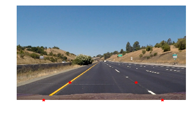
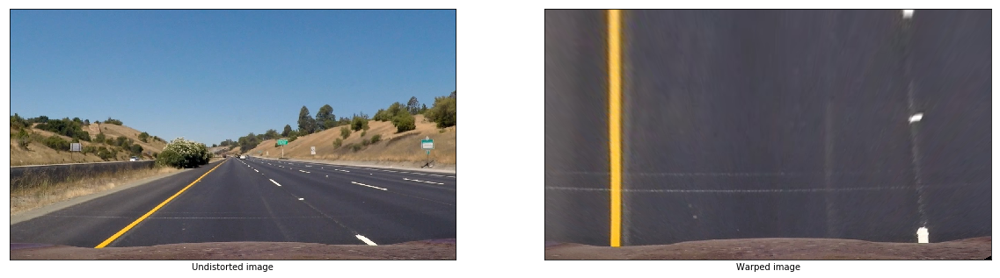
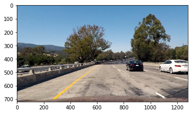
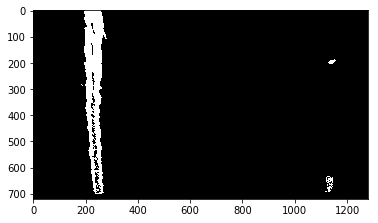
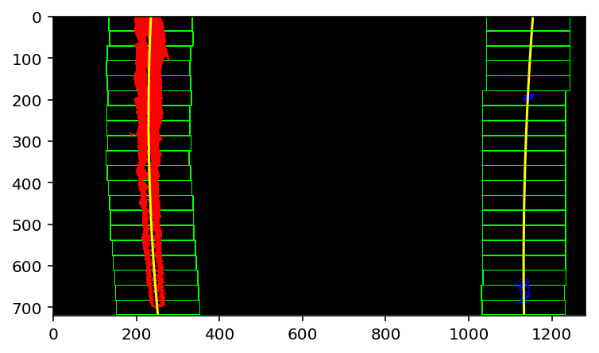
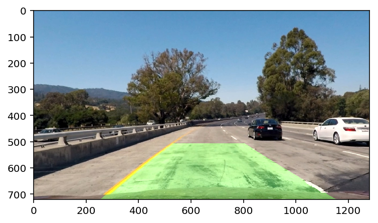

# Udacity-Self-Driving-Car_Advanced_Lane_Finding
**Project: Advanced Lane Finding** 
Lane finding is an important component of self-driving cars, the lane finding algorithms should be robust to change in road types, lightining and weather conditions and curvature of the road. In this project, I have built algorithm to identify left and right lanes based on the images from dash-mounted camera video. The algorithm uses advanced computer vision techniques to detect lanes, locate the car between two lanes and estimate curvature of the road.

The project is organised by the following sections:

* Camera calibration
* Applying perspective transform
* Detecting Lane Lines
* Colour and channel thresholding
* Finding the lanes. Polynomial fitting.
* Measuring curvature
* Image processing pipeline

## Camera calibration

Before processing dashcam videos we have to calibrate camera in order to undistort distortions introduced by camera lense. This is performed by using chessboard, 20 chessboard images are processed by the OpenCV function cv2.findChessboardCorners which locates corners in the chessboard image.

The located corners are then mapped to the real chessboard and mapping matrix obtained allowing to undistore images coming from the dashcam.

The results could be observed on an image, whilst distorions could be subtle the difference is clearly seen in when we subtract two images (original and undistorted one) from each another. 

## Perspective transform

Perspective transform allows to take 'bird's eye' view of the image in order to facilitate image processing. In particular it allows to represent parallel left and righ lane markers are they are - parallel. 

Function M = cv2.getPerspectiveTransform(src,dst) allows to obtain matrix M to transform images into 'bird's eye' view, matrix MInv allows to make inverse transformation from 'bird's eye' view into driver's view. In order to perform PT, we obtain four points on the left and right lane markers. Upon transpormation trapezoid formed by the four points should be represented by rectangle. The red points in the image below were selected on parallel lines in such a way that the distances on the left side and right side is the same.

  

we can illustrate this with a warped ('bird's eye') image:

  

## Detecting lane lines

In the next step, we perform HLS transformation (example - image below).

  

And using mask for the S-channel in HLS colour space we obtain preliminary line detection on the warp images.

  

The lanes are then detected using histogram of pixel values in the lower half of the thresholded image, this allows to locate x-values corresponding to the historgam peaks. Then using sliding windows method we can extract the lane pixels. The sliding windows are first placed centered at the base points locations for the left and right lanes, the x and y coordinates of all non-zero pixels are then compiled into seperate lists. The base points for the next horizontal band are then the columns with the maximum number of non-zero pixels in the current band. Secong degree polynomials are then fitted to the left and right lanes filtered with sliding boxes method.

The sliding box methid is illustrated below.

  

## Measuring curvature

This was done using the functions from the lectures.

### Image processing pipeline

The image processing pipeline performs all the steps listed above and then draws the lanes as well as prints out the curvature radiys and location of the car in the lane.

The steps are:
distortion correction -> perspective transform -> channel mask -> lane detection -> sanity check

  

  

  
